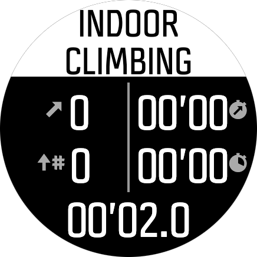
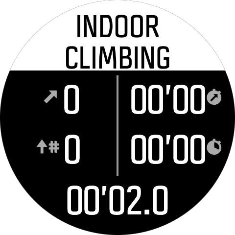
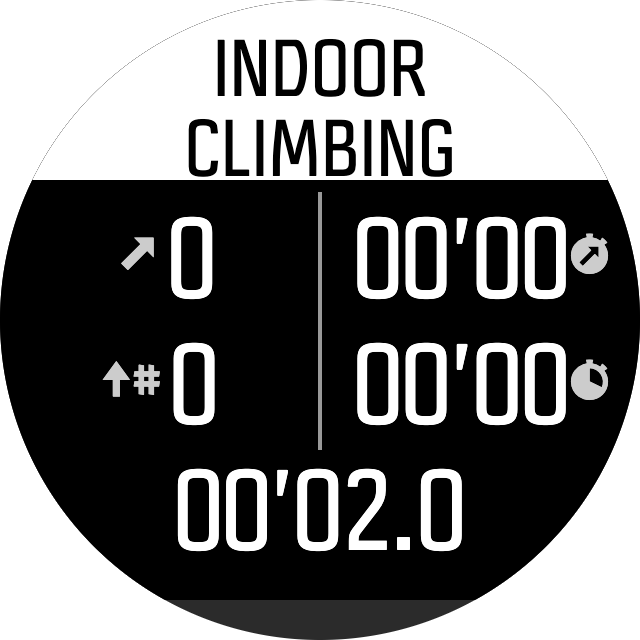
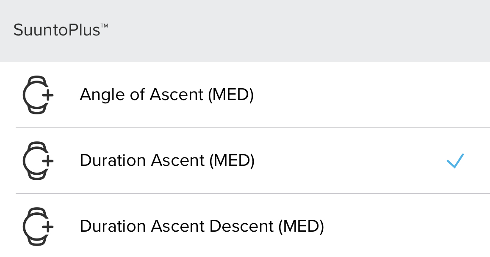

# Indoor Climbing Pro
Suunto App Indoor Climbing 3.0 Version

This app is designed specifically for **indoor rock climbing and bouldering**. It turns your Suunto watch into a professional climbing coach on your wrist, tracking your vertical performance, auto-lapping your attempts, and telling you exactly how long to wait before your next climb.

### Key Features (v3.0):
The application features a sleek, minimal UI utilizing the **Suunto Canvas API** for perfect layout alignment.

- **Smart Climbing State**: The app automatically detects when you are on the wall (`CLIMBING`) and when you are back on the ground (`RESTING`).
- **Auto-Lap Detection**: Automatically registers an Attempt (Lap) and resets your ascent meters the moment your descent distance matches your ascent distance. No manual button presses needed!
- **Dynamic Recovery Timer**: When you finish an ascent, the app calculates your recommended recovery time (based on a 1:3 climbing/rest ratio) and displays a live countdown timer (`REC MM:SS`) while you rest.
- **Dynamic HR Zones**: Integrated Heart Rate monitoring featuring a heart icon that changes color in real-time to match your current Suunto Heart Rate Zone (Zone 1 to 5).
- **Core Climbing Metrics**: Tracks your Number of Ascents, total Ascent Meters for the current route, Vertical Speed (m/m), Ascent Duration, and Total Workout Time on a single, easy-to-read screen.

### Screen Design:
*(Please update with screenshots of the final UI on the watch/simulator)*
  

 
 
### SA Outputs:
  #### Suunto Plus Metrics to analyze later in SA
  
    
   
  #### SA Summary Outputs
  
    
   
## To be improved:
  - Add more user-selectable recovery ratios.
  - Grade tracking input at the end of each lap.

---
### :fire: My Stats :

