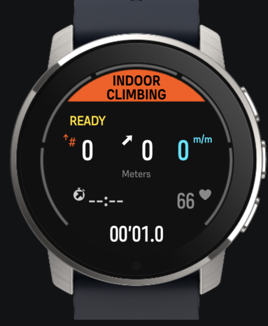
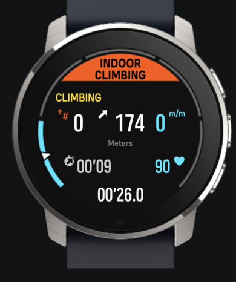
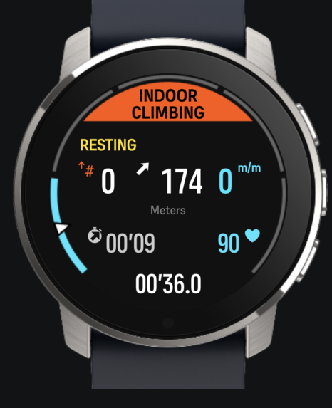

# Indoor Climbing
Suunto App Indoor Climbing 3.0 Version

<<<<<<< HEAD
This app is designed specifically for **indoor rock climbing and bouldering**. It turns your Suunto watch into a professional climbing coach on your wrist, tracking your vertical performance, auto-lapping your attempts, and telling you exactly how long to wait before your next climb.

### Key Features (v3.0):
The application features a sleek, minimal UI utilizing the **Suunto Canvas API** for perfect layout alignment.

- **Smart Climbing State**: The app automatically detects when you are on the wall (`CLIMBING`) and when you are back on the ground (`RESTING`).
- **Auto-Lap Detection**: Automatically registers an Attempt (Lap) and resets your ascent meters the moment your descent distance matches your ascent distance. No manual button presses needed!
- **Dynamic Recovery Timer**: When you finish an ascent, the app calculates your recommended recovery time (based on a 1:3 climbing/rest ratio) and displays a live countdown timer (`REC MM:SS`) while you rest.
- **Dynamic HR Zones**: Integrated Heart Rate monitoring featuring a heart icon that changes color in real-time to match your current Suunto Heart Rate Zone (Zone 1 to 5).
- **Core Climbing Metrics**: Tracks your Number of Ascents, total Ascent Meters for the current route, Vertical Speed (m/m), Ascent Duration, and Total Workout Time on a single, easy-to-read screen.
=======
This app is designed to show the meters climbed on each Ascent&Descent or climbing route without gps(Indoor Climbing). It shows the time spent on the ascent, the time spent on Ascent&Descent, the meters climbed and the number of attempts/runs. Saves in the SA the number of times we completed Ascent&Descent in a training. Saves in SA Suunto Plus the time that you spend in Ascent and the time spend for each Ascent&Descent. Generates a lap every time you finish the route or ascent/descent ***(you can also force that you have finished the Ascent/Descent or route by pressing the lap button).***

Other point of view is that this application can be used for training running up and down stairs with GPS.
>>>>>>> master

### Screen Design:
  

 

🎥 [Demo Video]
https://github.com/user-attachments/assets/d23900f9-a578-44d0-a06e-f920a5af0588

### SA Outputs:
  #### SA Summary Outputs
  
<<<<<<< HEAD
    
   
=======
       

## To fix Assap:
  - Today 05/02/2024 I tested it in a rock climbing wall with low height, and the problem is that if it is less than 3 meters it does not count that height (see how to do it).
## I will Try to do it if possible:
  - 15 different grading scales : https://www.guidedolomiti.com/en/rock-climbing-grades/
>>>>>>> master

---

### Corona Internal Implementation & Math Reference

Understanding the math inside `buildGenericGauge` allows you to customize it or build other types of circular rings:

#### Circle Geometry & Segments
The circle center is at `(W/2, W/2)`. The circular path spans **270 degrees** (from `135°` to `405°`, or `3*PI/4` to `9*PI/4` in radians), leaving a 90-degree gap at the bottom center of the watch.
* **Segment size:** For a 5-segment ring, each segment covers `54°` (`3*PI/10` radians).
* **Segment Gap:** A gap of `gapGrade = 0.06` radians (~3.4 degrees) separates each segment block.
* **Radius:** `Radius = (W - lineWidth)/2 - margin` (usually `margin = 2px`).
* **Active segment:** Thickness is drawn wide (`strokeWide = 8px`) with the zone's active color.
* **Inactive segments:** Thickness is drawn thin (`strokeThin = 4px`) with a gray color (`#666`).

#### Official Training Zone Colors
| Zone | Intensity | Color Hex | Color Name |
| :--- | :--- | :--- | :--- |
| **Zone 1** | Easy / Recovery | `#36E4FF` | Cyan |
| **Zone 2** | Aerobic | `#6EE76D` | Green |
| **Zone 3** | Tempo | `#FFDD33` | Yellow |
| **Zone 4** | Threshold | `#FF9F33` | Orange |
| **Zone 5** | Anaerobic | `#FF5640` | Red |
| **Inactive** | Inactive segment | `#666666` | Dark Gray |
